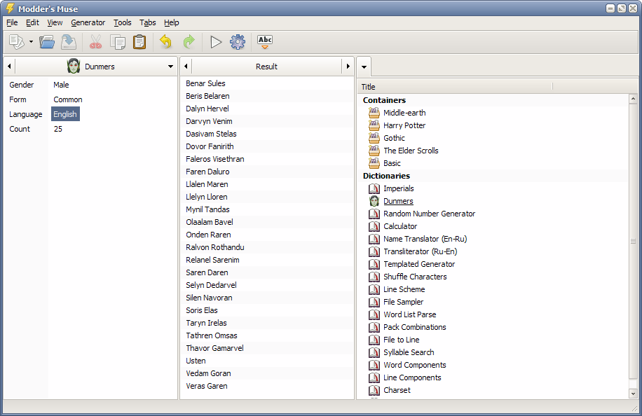
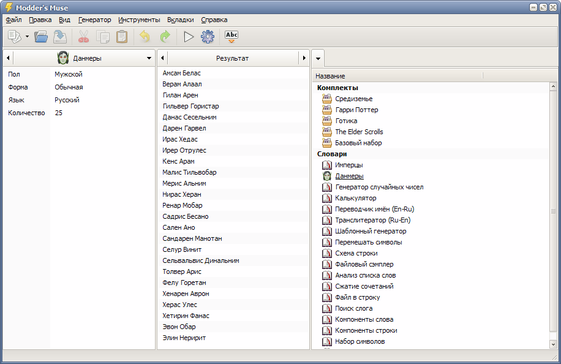

---
description:
  en: Word generator and text analyzer
  ru: Генератор слов и анализатор текста
metaDescription:
  en:
    Word generator with text processing and analysis functions. It is oriented towards game developers, modders, fan
    fiction creators, writers, translators and language experts.
  ru:
    Генератор слов с функциями преобразования и анализа текста. Ориентирован на разработчиков игр, моддеров, создателей
    фэнфика, писателей, переводчиков, лингвистов.
metaTitle:
  en: Modder's Muse, word generator
  ru: Modder's Muse, генератор слов
icon: ./images/moddersmuse-icon.png
started: 2006-06-27
published: 2009-06-01
finished: 2011-03-21
links:
  - http://nexusmods.com/oblivion/mods/7595/
---

<Content lang="en">
# Modder's Muse

Word generator with text processing and analysis functions. It is oriented towards game developers, modders, fan fiction
creators, writers, translators and language experts.

> The program has not been developed since 2011. The latest version is available for download for introductory purposes.

Using this program you can easily:

- select a suitable name for a character of book or game, choose a nickname or creative pseudonym;
- think of a name for city, fortress, village, dungeon, geographical object;
- create a unique name for organization, firm, product, program, musical band;
- use absolutely any text source for the sampled word generation;
- invent and formalize your own language and generate words, based on it's laws;
- perform transliteration, transcription, rendering or any other linguistic text processing;
- implement sure search and replace of uniform text specific parts;
- quickly prepare and carry out complex linguistic text parse;
- use the results of the parse for quick generator programming;
- entertain you and your friends, generating funny and absurd names, titles, words, phrases and so on.

General program specifics are:

- Revolutionary approach to word generation, processing and analysis.
- Implementation of any word generation principle.
- Visual programming of generator dictionaries.
- Handy organization and storage system for generated words.
- Intelligent processing and analysis of text and it's parts.
- Considered multithread interface.
- Potentialities to create and distribute your own program packages.
- Full Unicode support.

[Modder's Muse 3.0.0 beta 3](/files/moddersmuse_3.0.0_beta_3.exe)

## System requirements

- Windows XP - Windows 10

</Content>

<Content lang="ru">
# Modder's Muse

Генератор слов с функциями преобразования и анализа текста. Ориентирован на разработчиков игр, моддеров, создателей
фэнфика, писателей, переводчиков, лингвистов.

> Программа не разрабатывается с 2011 года. Последняя версия доступна для скачивания в ознакомительных целях.

С помощью этой программы вы с легкостью сможете:

- подобрать подходящее имя для персонажа книги или игры, выбрать никнейм или творческий псевдоним;
- придумать название для города, крепости, деревни, подземелья, географического объекта;
- создать уникальное название для организации, фирмы, продукта, программы, музыкальной группы;
- использовать совершенно любой текстовый источник для сэмплированной генерации слов;
- изобрести и зафиксировать свой собственный язык и генерировать слова, основанные на его законах;
- произвести транслитерацию, транскрипцию, переложение или другую лингвистическую обработку текста;
- осуществить надежный поиск и замену специфических частей однородного текста;
- быстро подготовить и провести сложный лингвистический анализ текста;
- использовать результаты анализа для быстрого программирования генератора;
- развлечь себя и друзей, создавая смешные и нелепые имена, названия, слова, фразы и т.п.

Основные особенности программы:

- Революционный подход к генерации, обработке и анализу слов.
- Реализация любых принципов генерации.
- Визуальное программирование словарей генератора.
- Удобная система хранения и организации сгенерированных слов.
- Интеллектуальное преобразование и анализ текста и его частей.
- Продуманный многопоточный интерфейс.
- Возможность создавать и распространять собственные компоненты программы.
- Полная поддержка Unicode.

[Modder's Muse v3.0.0 beta 3](/files/moddersmuse_3.0.0_beta_3.exe)

## Системные требования

- Windows XP — Windows 10

</Content>
