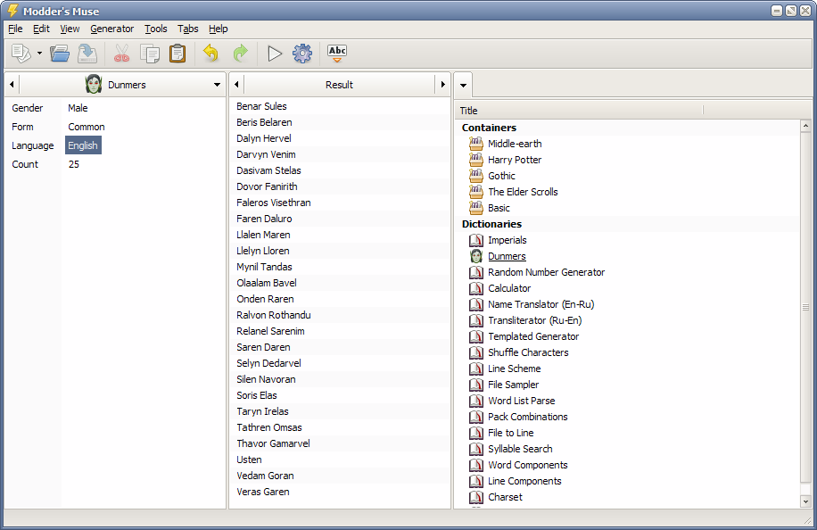

---
description:
  Professional word generator with text processing and analysis functions. It is oriented towards game developers,
  modders, fan fiction creators, writers, translators and language experts.
metaTitle: Modder's Muse, word generator
started: 2006-06-27
published: 2009-06-01
finished: 2011-03-21
links:
  - http://nexusmods.com/oblivion/mods/7595/
---

# Modder's Muse

> The program has not been developed since 2011. The latest version is available for download for introductory purposes.

Using this program you can easily:

- select a suitable name for a character of book or game, choose a nickname or creative pseudonym;
- think of a name for city, fortress, village, dungeon, geographical object;
- create a unique name for organization, firm, product, program, musical band;
- use absolutely any text source for the sampled word generation;
- invent and formalize your own language and generate words, based on it's laws;
- perform transliteration, transcription, rendering or any other linguistic text processing;
- implement sure search and replace of uniform text specific parts;
- quickly prepare and carry out complex linguistic text parse;
- use the results of the parse for quick generator programming;
- entertain you and your friends, generating funny and absurd names, titles, words, phrases and so on.

General program specifics are:

- Revolutionary approach to word generation, processing and analysis.
- Implementation of any word generation principle.
- Visual programming of generator dictionaries.
- Handy organization and storage system for generated words.
- Intelligent processing and analysis of text and it's parts.
- Considered multithread interface.
- Potentialities to create and distribute your own program packages.
- Full Unicode support.

If you have any questions or offers, please write at deadhero@yandex.ru.

[Modder's Muse 3.0.0 beta 3](/files/moddersmuse_3.0.0_beta_3.exe)

## System requirements

- Windows XP - Windows 10
