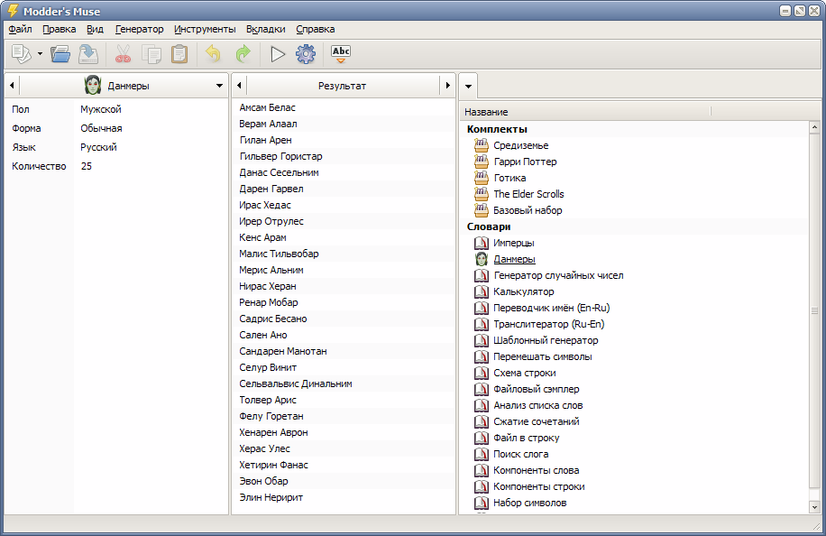

---
description:
  Профессиональный генератор слов с функциями преобразования и анализа текста. Ориентирован на разработчиков игр,
  моддеров, создателей фэнфика, писателей, переводчиков, лингвистов.
metaTitle: Modder's Muse, генератор слов
---

# Modder's Muse

> Программа не разрабатывается с 2011 года. Последняя версия доступна для скачивания в ознакомительных целях.

С помощью этой программы вы с легкостью сможете:

- подобрать подходящее имя для персонажа книги или игры, выбрать никнейм или творческий псевдоним;
- придумать название для города, крепости, деревни, подземелья, географического объекта;
- создать уникальное название для организации, фирмы, продукта, программы, музыкальной группы;
- использовать совершенно любой текстовый источник для сэмплированной генерации слов;
- изобрести и зафиксировать свой собственный язык и генерировать слова, основанные на его законах;
- произвести транслитерацию, транскрипцию, переложение или другую лингвистическую обработку текста;
- осуществить надежный поиск и замену специфических частей однородного текста;
- быстро подготовить и провести сложный лингвистический анализ текста;
- использовать результаты анализа для быстрого программирования генератора;
- развлечь себя и друзей, создавая смешные и нелепые имена, названия, слова, фразы и т.п.

Основные особенности программы:

- Революционный подход к генерации, обработке и анализу слов.
- Реализация любых принципов генерации.
- Визуальное программирование словарей генератора.
- Удобная система хранения и организации сгенерированных слов.
- Интеллектуальное преобразование и анализ текста и его частей.
- Продуманный многопоточный интерфейс.
- Возможность создавать и распространять собственные компоненты программы.
- Полная поддержка Unicode.

Если у вас есть какие-либо вопросы или предложения, пишите по адресу deadhero@yandex.ru.

[Modder's Muse v3.0.0 beta 3](/files/moddersmuse_3.0.0_beta_3.exe)

## Системные требования

- Windows XP — Windows 10
